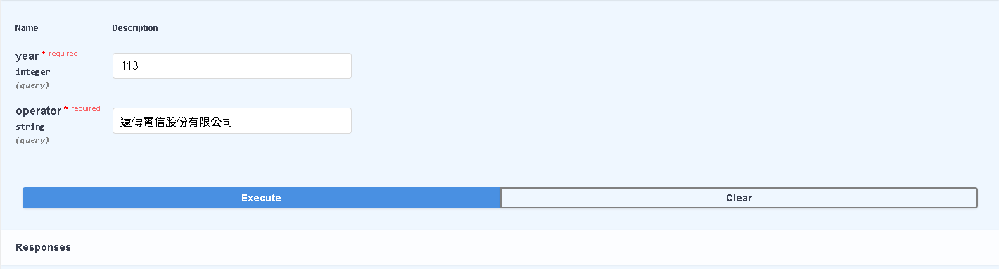
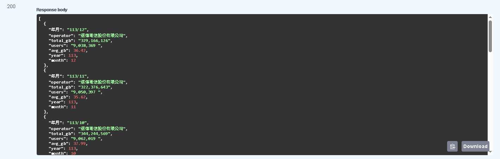

# 行動寬頻用戶查詢與資料庫管理工具  

- 本專案延續前項Python視覺化與報表自動化流程
- 將所有清洗後的行動寬頻資料彙整進 SQLite 建立本地資料庫  
- 同時提供(本機查詢工具)與(雲端Web API查詢)服務，支援不同使用情境 

藉由將資料轉換成可查詢的資料庫格式，  
本專案將原本分散在多個 Excel 報表的資料集中化管理，  
形成「資料整理 → 儲存 → 查詢」的完整流程，  
並提供後續視覺化、分析與應用程式串接更彈性的資料來源。 

---

###  本機查詢結果

---

###  Web API查詢結果

