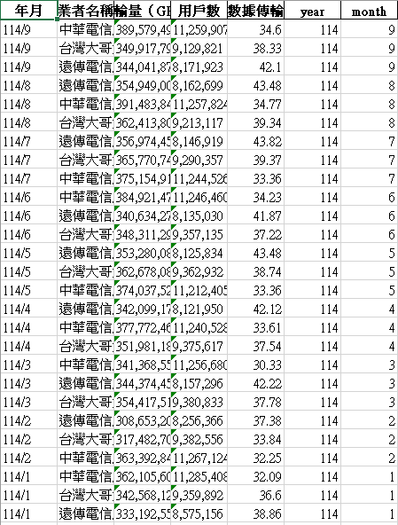
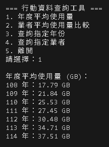
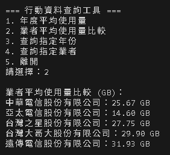

# 行動寬頻用戶 SQL 查詢與資料庫管理工具  
 
本專案將政府開放資料「行動寬頻用戶每月平均數據用量」轉換成 **SQLite 資料庫（mobile_usage.db）**，並提供一個 **互動式查詢工具（query_tool.py）** 讓使用者能快速查詢：

- 各年度平均使用量  
- 各電信業者平均使用量比較  
- 指定年份資料查詢  
- 指定業者資料查詢  

此專案示範如何將原始 CSV 數據轉換為 **可搜尋、可統計、可擴充的資料庫系統**。

---

### 經由自動化報表整理好的年份

---

###  查詢結果

## 技術亮點
- 使用 pandas 做資料清洗、欄位重命名、型別轉換  
- 設計 SQLite 資料表結構  
- Python sqlite3 執行 SQL 查詢  
- 查詢包含 GROUP BY、AVG、條件查詢  
- 自製終端機互動查詢工具

---

##  專案總結  
本專案展示 CSV 轉資料庫、SQL 查詢與 Python 自動化整合流程。  

未來可延伸：

- 月份範圍查詢  
- API / Web 查詢介面

